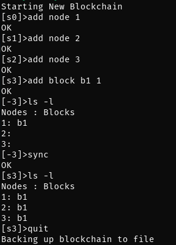

# Welcome to My Blockchain
***

## Summary 
This program is a simplified blockchain creation and management tool. A blockchain is a linked list of nodes that contain a linked list of blocks. 

## Description
The high level execution sequence is as follows:
1. Prompt user for input
2. Parse the input
3. Execute the command
4. Repeat 1. until the quit command is entered

## Installation
To compile the program, run **make** to generate the executable file my_blockchain.
To remove the object files, run **make clean**.

## Usage
The my_blockchain program has the following set of commands available:
* add: add node or block to the blockchain
* rm: remove node or block from the blockchain
* ls: list all nodes by their identifiers (nid). If -l is specified, all blocks associated with the node is listed
* sync: synchronize all of the nodes such that all nodes are composed of the same blocks. 
* quit: save the blockchain to a backup file and quit the program.
